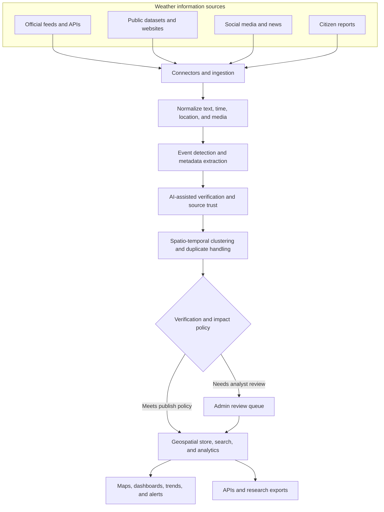

# Varunetra

## SIH26069-Weather | National Weather Big Data Analytics Platform

**Team:** Team Pony
**Problem statement:** National Weather Big Data Analytics Platform

Varunetra is a weather intelligence platform concept for India. It brings together reports from official services, public datasets, websites, social media, and citizens, then helps teams turn that fragmented information into structured, actionable weather events.

## Live demo

[Open the deployed Weather Admin dashboard](https://weather-admin-teampony.vercel.app)

## Local setup

The web prototype lives in `weather_ps/next` and requires Node.js with npm.

```bash
cd weather_ps/next
npm install
cp .env.example .env.local
npm run dev
```

Open [http://localhost:3000](http://localhost:3000) in your browser. The `.env.local` file is optional for the core demo; add `GOOGLE_TRANSLATE_API_KEY` there to enable Google Cloud Translation for Hindi and Marathi.

Useful commands:

```bash
npm run lint   # lint the application
npm run build  # create a production build
npm run start  # serve the production build
```

## The problem

Weather information is spread across many sources and formats. During a developing event, reports can be unstructured, duplicated, delayed, or misleading. Analysts need a way to find relevant signals, understand their reliability, and build a clear picture of what is happening.

## The proposed solution

The platform is designed to collect, verify, process, and visualize weather-related information from multiple sources across India. Its intended scope is a scalable, AI-assisted national weather intelligence platform that converts heterogeneous real-time reports into verified, structured, and analytics-ready data.

### Key capabilities

- **Multi-source ingestion:** Connect weather APIs, public datasets, websites, social platforms, and citizen reports.
- **Weather event detection:** Identify events such as rainfall, floods, thunderstorms, heatwaves, fog, dust storms, and strong winds.
- **AI-assisted verification:** Assess reports and source reliability to help flag misleading or untrusted information.
- **Duplicate handling:** Find related reports and group them around a shared event.
- **Metadata extraction:** Capture available time, location, city or state, GPS, photos, videos, and hashtags.
- **Big data processing:** Support a scalable real-time ingestion, processing, and storage pipeline.
- **Analytics and visualization:** Explore event trends, maps, alerts, and statistics by date, event, location, and verification status.
- **Admin review:** Give analysts tools to monitor sources and review and manage collected reports.

## What the prototype demonstrates

The current web prototype includes:

- An India-focused operational dashboard and interactive weather event map.
- Event search and filters, with an event detail inspector.
- Report and verification trend charts.
- Explainable verification evidence and human review actions.
- Source connection controls and a pipeline health view.
- Responsive desktop, tablet, and mobile layouts.
- English, Hindi, and Marathi interface options.

**Demo data notice:** Reports, metrics, and source activity currently use deterministic simulated data. The prototype demonstrates the intended workflows; it does not yet connect to live weather feeds or run a production big data or machine learning pipeline.

## Technology stack

### Implemented prototype

- **Framework:** Next.js 16 and React 19
- **Language:** TypeScript
- **Styling:** Tailwind CSS 4
- **Charts and visualization:** Visx, with custom SVG-based map and chart components
- **Motion and UI:** Motion, Base UI, and Lucide icons
- **Translation:** Bundled English, Hindi, and Marathi translations, with an optional server-side Google Cloud Translation route

### Proposed production architecture

These are documented architecture choices, not components currently running in the demo:

- **Streaming and ingestion:** Apache Kafka or Redpanda
- **Stream processing:** Apache Flink or Spark Structured Streaming
- **Operational geospatial data:** PostgreSQL with PostGIS
- **Search and analytics:** OpenSearch and ClickHouse or Apache Druid
- **Media storage:** S3-compatible object storage
- **ML services:** Python/FastAPI services for classification, media analysis, and confidence scoring
- **Live dashboard updates:** Server-Sent Events (SSE) or WebSockets
- **Observability:** OpenTelemetry, Prometheus, and Grafana

## Proposed platform architecture

The diagram below shows the planned flow from multi-source reports to verified weather intelligence. It represents the proposed production architecture; the current prototype uses simulated data.


