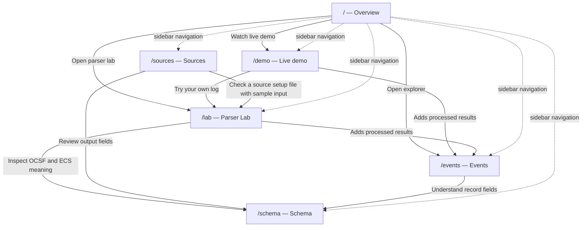
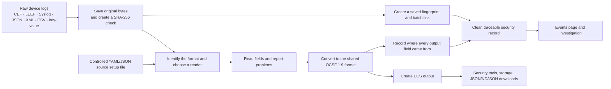
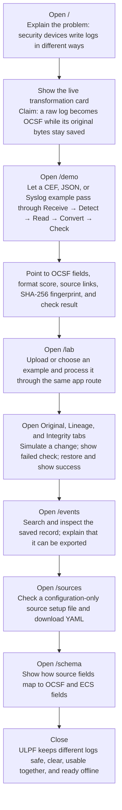

# ULPF Website Route and Presentation Guide

Universal Log Pre-processing Framework (ULPF) is the SIH 2026 working prototype for problem statement SIH26156. It turns different types of firewall and security-device logs into one clear record format, while keeping the original log available.

This guide is for a jury presenter and for a new teammate who needs to understand the website, the proof it provides, and the order in which to demonstrate it.

## What this prototype proves

ULPF can read the bundled CEF, LEEF, Syslog, JSON, XML, CSV, and key-value examples. It keeps the original log, creates a SHA-256 fingerprint to check for changes, shows where each output value came from, produces OCSF and ECS output, and runs locally without a cloud service. Parser Lab and the automatic demo use the same processing route.

It is a single-computer demo. It does not claim to have live log collection, cloud storage, a large distributed system, or production-scale speed. Its hashes can show when saved log data has changed, but they cannot prove who created a log; that would need digital signatures and secure key storage in a real deployment.

Primary users are security operations teams, digital-forensics analysts, SIEM/data-lake teams, and administrators onboarding new perimeter-device formats.

## Route reference

| Route | Screen | What it does | Key actions | Main connections |
| --- | --- | --- | --- | --- |
| `/` | Overview | Introduces the problem, value proposition, proof points, and an example transformation. | Open the automatic demo, Parser Lab, or Events explorer. | `/demo`, `/lab`, `/events` |
| `/demo` | Live demo | Automatically processes real example logs through the same app processing route. | Pause/resume, select an example, continue to Parser Lab. | `/lab`; processed results appear in `/events`. |
| `/lab` | Parser Lab | Lets users paste/upload a log, process it, inspect results, check for changes, and download records. | Upload, select sample, set format, process, simulate a change, verify, export. | `/events`, `/schema`, and `/sources`. |
| `/events` | Events | Searches and inspects processed records saved in the current browser session. | Search/filter, select event, export, clear history, load example data. | Receives results from `/demo` and `/lab`; field explanations come from `/schema`. |
| `/sources` | Sources | Shows how to add a parser using a configuration file instead of custom code. | Define, map, validate, save locally, download YAML. | Uses the same processing rules as `/lab`; fields are explained in `/schema`. |
| `/schema` | Schema | Explains OCSF, the extra ULPF integrity fields, and how source fields map to OCSF and ECS. | Select a record type and review its fields. | Explains fields used in `/lab`, `/events`, and `/sources`. |

## Route connection map

The sidebar allows any order, but the clearest journey is Overview → Live demo → Parser Lab → Events → Sources → Schema. It starts with the problem, shows one log being processed automatically, lets the jury test the same system, then explains saved proof, adding new sources, and the shared output format.

## Route-by-route explanation

### `/` — Overview

**Problem solved:** Security devices write logs in many different formats. The overview makes the ULPF promise easy to understand: every log becomes one shared format without losing the original log.

**What to present:** Start with the main statement and the live transformation card. Point to a raw key-value log becoming an OCSF Network Activity record, then show its evidence hash. Explain the three proof points: exact original bytes are kept, it works offline, and it uses OCSF 1.9.

**Interaction and state:** The principal actions link to `/demo` and `/lab`; the example event table links to `/events`. Most overview values are seeded demonstration context, not runtime throughput claims.

**Feeds and next step:** This is the starting page. Move to `/demo` to show an example log being processed automatically.

### `/demo` — Live demo

**Problem solved:** A new visitor should see the full process without learning controls first. This page cycles real bundled examples through receive, detect, read, convert, and check steps.

**What to present:** Let the sequence move from original log bytes to OCSF fields. Point out the detected format score, source/destination, action, severity, evidence fingerprint, the number of source-to-output links, and the final check result. Switch between Palo Alto CEF, Suricata EVE JSON, and Syslog to show it handles different formats.

**Interaction and state:** The showcase uses the same local processing route as Parser Lab. It moves through five steps and cycles examples automatically; the user can pause, resume, or choose one manually. Each completed result is saved in the current browser session for the Events page.

**Feeds and next step:** It sends processed results to `/events`. Use “Try your own log” to open `/lab` and prove the same system accepts uploaded or pasted logs.

### `/lab` — Parser Lab

**Problem solved:** The automatic demo shows the simple path; Parser Lab shows that the system is hands-on and easy to inspect. It handles uploaded or pasted logs, format detection or manual format choice, processing, checks, and download.

**What to present:** Upload the bundled Palo Alto CEF sample or choose an example. Process it with auto-detect, then open OCSF, ECS, Original, Lineage, and Integrity tabs. Use Simulate tamper, then run Verify evidence to show the hash no longer matches. Restore the evidence and check it again. Emphasize that the original bytes and source-to-output links stay with the processed record.

**Interaction and state:** Upload accepts supported text log files up to 1 MB. Pasted text is safely wrapped before processing, while uploads use the exact uploaded bytes for the hash. The format can be detected automatically or chosen manually. One upload can contain many records. Result tabs change the view, verification updates the check result, simulated tampering creates a deliberate failed check, and OCSF/ECS output can be downloaded.

**Feeds and next step:** Each successful result is added to local browser history and can be examined in `/events`. Use `/schema` to explain OCSF/ECS fields or `/sources` to show how another format can be added safely.

### `/events` — Events

**Problem solved:** Analysts need one place to return to, filter, inspect, and download results created by the live demo or Parser Lab.

**What to present:** Show that a record created a moment ago appears with the session’s other events. Filter by format or severity, select an event, and inspect its clear field view. This proves the processing is not just a visual trick; it creates records that can be used for investigation or exported to other security tools.

**Interaction and state:** The page loads results saved in the current browser session. It supports text search, severity/format filters, selecting a record, exporting, clearing session history, and loading example data. Clearing affects only this browser session.

**Feeds and next step:** It consumes `/demo` and `/lab` batches. Move to `/schema` to decode the common data model, or `/sources` to explain how a new source can join the same event ecosystem.

### `/sources` — Sources

**Problem solved:** A general log reader must add new devices safely without asking operators to run unknown custom code. This page shows how to add a source through a controlled configuration file.

**What to present:** Walk through source details, field mapping, validation, and the accepted configuration. Explain that a new source uses a reviewed YAML/JSON file with limited safe rules, not a plugin that runs code. Check it against example input, show the processed output, and download the configuration.

**Interaction and state:** The multi-step builder edits a draft configuration, maps source fields to output fields, checks it with an example, saves it locally, and downloads it as YAML. Local saves stay in this browser and are limited; this is not a shared online source list.

**Feeds and next step:** The configuration uses the same processing rules as `/lab`. `/schema` explains the OCSF output fields, while `/events` shows the result once a source has been processed.

### `/schema` — Schema

**Problem solved:** Different tools can work together only when field names mean the same thing. This page explains the OCSF 1.9 fields and ULPF’s extra evidence/check fields.

**What to present:** Select Network Activity, Detection Finding, and Record Integrity. Show source field names moving into shared OCSF fields and then ECS export fields. State that ULPF keeps the original log, its source-to-output links, and its checks beside the main OCSF record.

**Interaction and state:** Selecting a class changes its description and core fields. The mapping panel is explanatory and intentionally read-only.

**Feeds and next step:** This page explains the fields used by Parser Lab, Events, and source setup. It is a useful final technical screen after `/sources`.

## How a log moves through the system

## Detailed presentation flow

## Presenter notes

**Claims to make:** ULPF reads real bundled log examples; keeps the original data; creates SHA-256 checks and saved links between results; shows where each output value came from; creates OCSF/ECS output; lets teams add sources with a controlled configuration file; and runs locally without cloud calls.

**Claims to avoid:** Do not claim live network collection, a large enterprise system, support for every OCSF record type, cloud saving, or proof of who created a log. Hashes can show unexpected changes, but digital signatures and secure keys are needed to prove who sent it.

**Useful handoffs:** `Overview → Live demo` explains the value quickly; `Live demo → Parser Lab` proves the same processing works hands-on; `Parser Lab → Events` proves results stay available in the local session; `Events → Sources → Schema` explains how more sources can be added and how they share the same field format.
