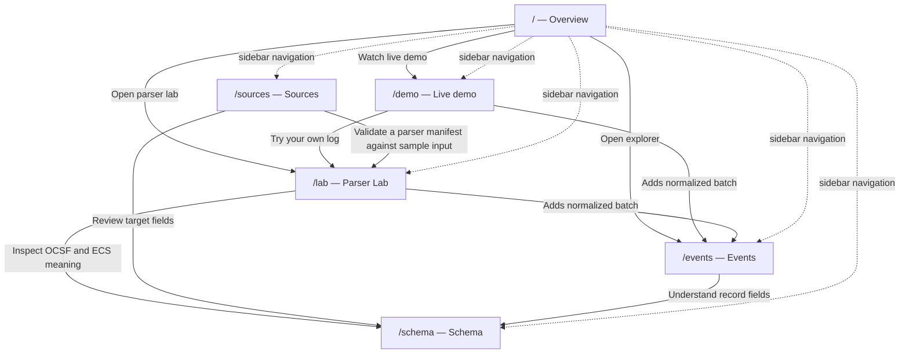
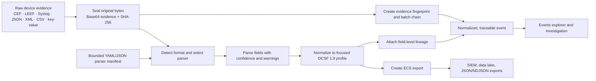
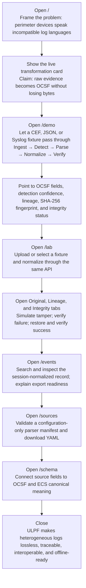

# ULPF Website Route and Presentation Guide

Universal Log Pre-processing Framework (ULPF) is the SIH 2026 working reference implementation for problem statement SIH26156. It converts heterogeneous perimeter-device logs into lossless, traceable OCSF 1.9 records and portable ECS exports.

This guide is for a jury presenter and for a new teammate who needs to understand the website, the proof it provides, and the order in which to demonstrate it.

## What this prototype proves

ULPF genuinely parses bundled CEF, LEEF, RFC 5424 Syslog, JSON/NDJSON, XML, CSV, and key-value fixtures. It preserves raw evidence, creates SHA-256 fingerprints and tamper-evident batch chains, records field-level lineage, produces a focused OCSF 1.9 profile plus ECS exports, and runs locally without a cloud dependency. Parser Lab and the automatic showcase use the same normalization API.

It is a single-node reference demo, not a claim of live collectors, Kafka, object storage, distributed workers, managed key infrastructure, or billion-event production throughput. Hash chains demonstrate unexpected modification; they do not prove signer/producer authenticity without a production key-management and signature service.

Primary users are security operations teams, digital-forensics analysts, SIEM/data-lake teams, and administrators onboarding new perimeter-device formats.

## Route reference

| Route | Screen | What it does | Key actions | Main connections |
| --- | --- | --- | --- | --- |
| `/` | Overview | Introduces the problem, value proposition, proof points, and an example transformation. | Open the automatic demo, Parser Lab, or Events explorer. | `/demo`, `/lab`, `/events` |
| `/demo` | Live demo | Automatically processes real fixture logs through the normalization API. | Pause/resume, select a fixture, continue to Parser Lab. | `/lab`; generated batches appear in `/events`. |
| `/lab` | Parser Lab | Lets users paste/upload a log, normalize it, inspect outputs, test integrity, and download records. | Upload, select sample, override format, normalize, simulate tamper, verify, export. | `/events`, `/schema`, and the implementation concept shown in `/sources`. |
| `/events` | Events | Searches and inspects normalized records accumulated in browser-local session state. | Search/filter, select event, export, clear history, load fixture data. | Receives results from `/demo` and `/lab`; schema context comes from `/schema`. |
| `/sources` | Sources | Demonstrates configuration-only parser onboarding via bounded manifests. | Define, map, validate, save locally, download YAML. | Uses the same parser contract as `/lab`; supported vocabulary is explained in `/schema`. |
| `/schema` | Schema | Explains the OCSF profile, ULPF integrity extension, and source-to-OCSF-to-ECS mapping. | Select a class and review its fields. | Gives semantic context to `/lab`, `/events`, and `/sources`. |

## Route connection map

The sidebar permits any order, but the strongest proof journey is Overview → Live demo → Parser Lab → Events → Sources → Schema. It starts with the problem, proves one transformation automatically, lets the jury test the same system, then explains traceability, onboarding, and interoperability.

## Route-by-route explanation

### `/` — Overview

**Problem solved:** Security devices emit many incompatible log formats. The overview makes the ULPF promise immediately understandable: every log becomes one shared security language without throwing away original evidence.

**What to present:** Start with the hero statement and the live transformation card. Point to raw key-value evidence becoming an OCSF Network Activity record, then identify the evidence hash. Use the proof points—exact bytes preserved, offline operation, OCSF 1.9—and the process list to establish the deterministic pipeline before any detailed screen.

**Interaction and state:** The principal actions link to `/demo` and `/lab`; the example event table links to `/events`. Most overview values are seeded demonstration context, not runtime throughput claims.

**Feeds and next step:** It is the conceptual entry point. Move to `/demo` for an automatic real-fixture transformation, which is the best first proof for a jury.

### `/demo` — Live demo

**Problem solved:** A new visitor should see the complete transformation without needing to learn controls first. This route cycles real bundled fixtures through ingest, detect, parse, normalize, and verify.

**What to present:** Let the sequence progress from original bytes to OCSF fields. Call out format confidence, source/destination fields, action, severity, evidence fingerprint, lineage count, and final integrity status. Switch between Palo Alto CEF, Suricata EVE JSON, and RFC 5424 Syslog to prove format variety.

**Interaction and state:** The showcase uses the same local normalization API as Parser Lab. It automatically advances the five stages and cycles samples; the user can pause, resume, or choose a sample manually. Each completed batch is retained in browser-local application state for the Events route.

**Feeds and next step:** It supplies normalized batches to `/events`. Use the “Try your own log” action to enter `/lab` and prove that the same pipeline accepts upload or pasted evidence.

### `/lab` — Parser Lab

**Problem solved:** The automatic demo proves the happy path; Parser Lab proves the system is interactive and inspectable. It handles uploaded or pasted raw evidence, format detection/override, normalization, evidence validation, and export.

**What to present:** Upload a bundled Palo Alto CEF sample or choose a fixture. Normalize it with auto-detection, then open OCSF, ECS, Original, Lineage, and Integrity tabs. Use Simulate tamper, then run Verify evidence to demonstrate a hash mismatch. Restore the evidence and verify again. Emphasize that the original bytes and lineage stay attached to the normalized record.

**Interaction and state:** Upload accepts supported text log formats up to 1 MB; pasted text is Base64-wrapped before transport, while file mode hashes uploaded bytes. Format may be auto-detected or overridden. A normalized batch supports multiple records. Result tabs change the view, integrity verification updates its state, tampering changes the current evidence for a deliberate negative test, and OCSF/ECS output can be downloaded.

**Feeds and next step:** Each successful normalization is added to local browser history and can be examined in `/events`. Use `/schema` to explain the OCSF/ECS fields or `/sources` to explain safe onboarding of another format.

### `/events` — Events

**Problem solved:** Analysts need a usable place to revisit, filter, inspect, and export the normalized results created by the live demonstration or Parser Lab.

**What to present:** Show that a record generated moments ago appears alongside the session’s other events. Filter by format or severity, select an event, and inspect its structured output. This proves that normalization is not a one-off visual transformation; it creates portable security records for investigation and downstream tooling.

**Interaction and state:** The route hydrates browser-local batches. It supports text search, severity/format filtering, selecting a record, exporting, clearing session history, and loading fixture data. Clearing is intentionally local to the browser session.

**Feeds and next step:** It consumes `/demo` and `/lab` batches. Move to `/schema` to decode the common data model, or `/sources` to explain how a new source can join the same event ecosystem.

### `/sources` — Sources

**Problem solved:** A universal parser must onboard devices safely without asking operators to deploy arbitrary custom code. This workspace demonstrates bounded, configuration-only parser manifests.

**What to present:** Walk through source details, mapping, validation, and the accepted-manifest result. Explain that a new source is represented by a reviewed YAML/JSON configuration with bounded transforms, not an executable plugin. Validate against sample input, show normalized output, and download the manifest.

**Interaction and state:** The multi-step builder edits a draft manifest, maps source fields to target fields, validates it by normalizing a sample, allows local save, and supports YAML download. Local persistence is browser-scoped and capped; it is not a shared registry service.

**Feeds and next step:** The manifest uses the same normalization contract demonstrated in `/lab`. `/schema` explains the target OCSF vocabulary, while `/events` shows the interoperable result once a source is normalized.

### `/schema` — Schema

**Problem solved:** Interoperability only works when teams agree on field meaning. This route makes the focused OCSF 1.9 profile and ULPF’s evidence/integrity additions concrete.

**What to present:** Select Network Activity, Detection Finding, and Record Integrity. Show source field aliases flowing into canonical OCSF fields and then ECS export fields. State that ULPF adds evidence, lineage, and integrity around the core OCSF record rather than hiding the original source semantics.

**Interaction and state:** Selecting a class changes its description and core fields. The mapping panel is explanatory and intentionally read-only.

**Feeds and next step:** This page supplies the semantic model for Parser Lab, Events, and source onboarding. It is a useful final technical close after `/sources`.

## Conceptual data and evidence flow

## Detailed presentation flow

## Presenter notes

**Claims to make:** ULPF uses deterministic parsers for real bundled fixtures; preserves exact evidence; creates SHA-256 fingerprints and tamper-evident chains; exposes field-level lineage; emits OCSF/ECS output; enables bounded configuration-based onboarding; and runs locally without runtime cloud calls.

**Claims to avoid:** Do not claim a live network collector, an enterprise-scale distributed runtime, full OCSF-class coverage, cloud persistence, or proof of who created a log. Hashes detect unexpected modification, but signatures and managed keys are needed for producer authenticity.

**Useful handoffs:** `Overview → Live demo` establishes the value quickly; `Live demo → Parser Lab` proves the same pipeline is hands-on; `Parser Lab → Events` proves records persist for the local investigative session; `Events → Sources → Schema` explains extensibility and a shared security language.
