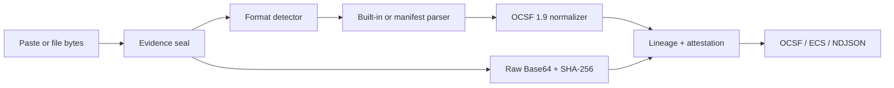
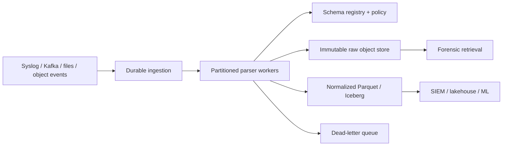

# ULPF Architecture Brief

## Reference milestone

The current implementation is a single-node Next.js reference pipeline. It accepts pasted text or uploaded files, processes evidence in a Node.js route handler, and returns normalized records to an offline-capable browser UI. Browser storage holds a capped session history and custom parser manifests. No log is sent to an external service.

The API enforces a 1 MB input limit and a 100-event batch limit. Built-in formats are CEF, LEEF, RFC 5424 Syslog, JSON/NDJSON, XML, CSV and key-value. Every successful event contains original text, Base64 evidence, byte count, SHA-256 fingerprint, unmapped attributes and field-level lineage.

## Production evolution

- Partition by tenant and source while preserving per-source ordering for hash chains.
- Store original bytes first in immutable, retention-controlled object storage.
- Run stateless parser workers horizontally behind durable partitions.
- Version parser manifests and OCSF mappings in a reviewed schema registry.
- Write normalized events to columnar lakehouse storage and streaming SIEM sinks.
- Send malformed or policy-rejected records to a replayable dead-letter queue.
- Use signed attestations backed by managed or hardware-protected keys when authenticity is required.

One billion events per day is about 11,574 events per second on average. A production design must size for measured peak factors, event size, replication, enrichment latency and sink backpressure. This repository does not claim that throughput without a distributed benchmark.

## Security and deployment

The runtime uses no cloud API, remote font, telemetry script or CDN. The Docker image runs as a non-root user and exposes a health endpoint. Manifest transforms are enumerated; arbitrary code is never evaluated. Regular expressions are length-bounded and checked for unsafe constructions. A production deployment must additionally provide authentication, tenant isolation, authorization, secret management, encrypted transports, audit logging and signed release artifacts.
