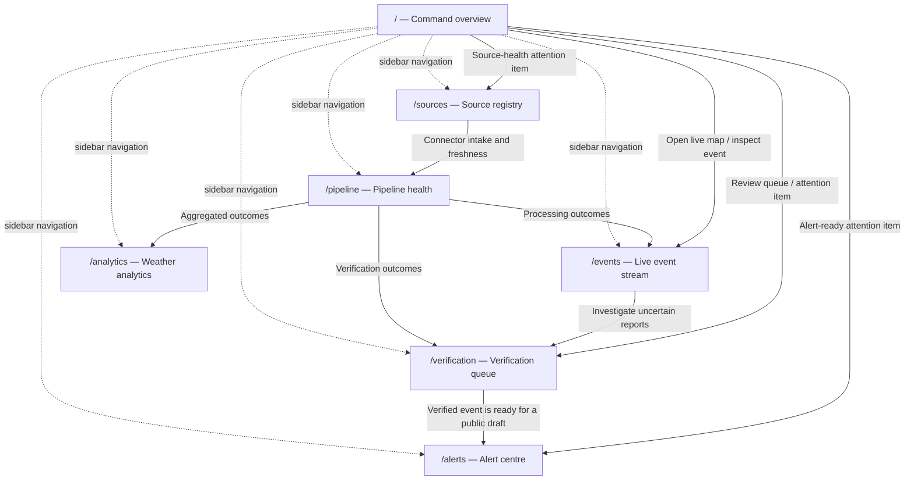
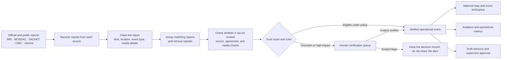
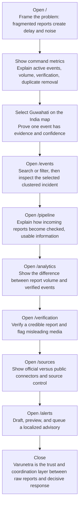

# Varunetra Website Route and Presentation Guide

Varunetra is a national weather monitoring prototype. It brings weather reports from many places into one clear view so disaster teams can see what needs attention, what needs a human check, and what is ready to share with the public.

This guide is for a jury presenter and for a new teammate who needs to understand the complete website journey.

## What this prototype proves

The dashboard shows the intended working flow: sources send in reports; the system cleans and groups them, gives each one a trust score, and sends it either for human review or toward a public alert. The events, numbers, source statuses, and charts are fixed demo data so the presentation is reliable. The interface actions—filtering, selecting, reviewing, turning sources on/off, retrying jobs, writing alerts, and generating previews—work locally. The prototype does not claim to use live government feeds or a live production system.

Primary users are national and state emergency operations centres, weather and disaster-management analysts, district administrators, and public-information teams.

## Route reference

| Route | Screen | What it does | Key actions | Main connections |
| --- | --- | --- | --- | --- |
| `/` | Command overview | Gives the national operating picture and the highest-priority items. | Select a map incident; open the live map or review queue. | `/events`, `/verification`, `/alerts`, `/sources` |
| `/events` | Live event stream | Explores weather incidents grouped by place and report type. | Search, filter by hazard, select an event or map marker. | Entered from `/`; supports investigation before `/verification`. |
| `/verification` | Verification queue | Lets an analyst decide whether unclear or important reports can be trusted. | Verify, flag, undo, switch pending/resolved views. | Entered from `/` or after event investigation; verified work informs `/alerts`. |
| `/analytics` | Weather analytics | Separates incoming report volume from verified operational intelligence. | Review trend, hazard mix, regional intensity, and quality measures. | Explains outcomes of `/pipeline` and `/verification`. |
| `/alerts` | Alert centre | Converts a verified incident into a reviewable citizen advisory. | Choose event, edit message, enable channels, preview, queue. | Follows `/verification`; is linked from overview attention items. |
| `/sources` | Source registry | Shows and controls the connectors that supply the national graph. | Switch source intake, change source category, test connectors. | Explains the starting point of `/pipeline`. |
| `/pipeline` | Pipeline health | Shows the processing stages, performance, and recoverable exceptions. | Retry failed jobs. | Explains how `/sources` becomes events, verification, and analytics. |

## Route connection map

The sidebar exposes every route, but the recommended story is not a random tour. Start with the command view, investigate a concrete event, explain how uncertain records are governed, show how the system is supplied and monitored, then end at public alert readiness and measurable impact.

## Route-by-route explanation

### `/` — Command overview

**Problem solved:** Operators need one place to understand national conditions before opening individual reports. The screen combines active events, daily reports, verification rate, duplicate removal, an India map, the selected event, items needing attention, report trends, and source health.

**What to present:** Begin with the four headline numbers. They show that the platform handles many mixed reports, not just a weather forecast. Select the Guwahati marker and point to its severity, trust score, source details, and summary. This is the main idea: many reports can become one trusted event.

**Interaction and state:** Choosing a marker changes the selected incident and its brief. The header buttons lead directly to the live event monitor and review queue. Attention cards lead to verification, alerts, or sources; the source card makes a useful bridge into the supply side of the platform.

**Feeds and next step:** This is the consumer of the whole workflow. Move to `/events` to show the selected map event in investigative detail, or to `/verification` when the story is about human oversight.

### `/events` — Live event stream

**Problem solved:** A national map helps set priorities, but analysts also need a quick way to find and inspect one incident. This page combines search, event-type filters, a map, and a detailed list of grouped reports.

**What to present:** Filter by weather type and search for a city such as Mumbai. Then select the Guwahati flood item. Explain that one marker stands for a group of matching reports, not every social post or sensor reading. Its trust score and source details help the operator decide what to do.

**Interaction and state:** Search text and hazard filter reduce the visible stream. Selecting either a stream card or a map marker updates the active event. An empty state appears when no record matches, demonstrating that the view is a usable workspace rather than a static image.

**Feeds and next step:** This page shows reports after the system has cleaned, grouped, and checked them. Take unclear or serious cases to `/verification`; use `/analytics` to see the bigger pattern.

### `/verification` — Verification queue

**Problem solved:** Important decisions should not depend only on an automatic score. This page gives an analyst a clear place to decide whether an unclear report is trustworthy or misleading.

**What to present:** Open the Pending tab and show the AI score, source checks, and trust bar. Verify the credible Dehradun report and flag the reused Puri cyclone media. Explain that the system gives a recommendation and supporting details, but a person makes the important decision.

**Interaction and state:** Verify and Flag actions update the record’s decision state; Undo restores it. Pending and Resolved tabs present the queue before and after analyst action. If all items are resolved, the interface intentionally shows a queue-cleared state.

**Feeds and next step:** Inputs are the uncertain/high-impact cases surfaced by the event workflow and scoring pipeline. A verified incident can be taken to `/alerts` for a geo-targeted public advisory.

### `/analytics` — Weather analytics

**Problem solved:** Leaders need to understand whether more reports mean more real events. This view separates report velocity from verified output and summarizes risk by hazard and geography.

**What to present:** Use the national trend to distinguish incoming reports from AI-verified events. Then point to regional intensity, hazard mix, auto-verification, human agreement, false-positive rate, and removed noise. These measures explain why Varunetra is a trust-and-coordination layer rather than a weather app.

**Interaction and state:** This route is intentionally a readable decision summary; its values are seeded rather than live-query controls.

**Feeds and next step:** The charts aggregate pipeline and verification outcomes. Return to `/pipeline` to explain the operational stages that produce the metrics, or `/events` to investigate a high-intensity region.

### `/alerts` — Alert centre

**Problem solved:** A trusted event must become a clear public message without losing its location, severity, or operator control. This screen drafts an alert message and previews what citizens would see.

**What to present:** Select a verified incident, then show how the headline, public instruction, delivery channels, and preview are all controlled. Generate the preview before queueing the alert. State that the prototype prepares an advisory for supervisor approval; it does not claim to send a real national warning.

**Interaction and state:** Selecting an event updates its verification context. The presenter can edit headline and instruction, toggle mobile/web and SMS, generate a preview, and queue the completed draft. Queueing only succeeds when text and at least one channel are present, then displays the supervisor-approval confirmation.

**Feeds and next step:** This route follows a verified event from `/verification`. It is the public-facing endpoint of the operational workflow; return to `/sources` or `/pipeline` only when explaining how trustworthy evidence was created.

### `/sources` — Source registry

**Problem solved:** Operators need visibility and control over the official, community, and public-signal connectors contributing to the national graph. A degraded source should be visible without deleting its history.

**What to present:** Show the official and community tabs, source health, intake rate, enabled connector count, and the distinction between trusted official inputs and corroborated public signals. Toggle a public source and test all connectors to demonstrate operational control.

**Interaction and state:** Each source can be enabled or disabled for new intake. Tabs change source category. Testing connectors displays a temporary healthy result. These are local prototype controls over seeded source records.

**Feeds and next step:** Sources are the entry point to the system. Go to `/pipeline` immediately afterward to show the journey from raw intake to usable intelligence.

### `/pipeline` — Pipeline health

**Problem solved:** A national system must explain not just results but the health of the path that created them. This screen exposes stage throughput, health, latency, queued jobs, and recoverable exceptions.

**What to present:** Walk left to right through receiving reports, cleaning them, checking them, and sending the result to the right screens. Point to the processing speed, delay, and problem table. Use Retry failed jobs to show that failed work can be tried again instead of disappearing.

**Interaction and state:** Retrying briefly changes the button state. The stage cards and problem list use demo data; they show the controls a real operator would need.

**Feeds and next step:** It starts with `/sources` and leads to the event monitor, review queue, and analytics. Use it to explain the system in the middle of a presentation, then go to `/analytics` for results or `/verification` for the human check.

## Conceptual intelligence flow

## Detailed presentation flow

## Presenter notes

**Claims to make:** Varunetra shows how India-scale weather reports from many sources can be checked, grouped, explained, sent to people when unclear, and prepared for response.

**Claims to avoid:** Do not say that the dashboard receives live IMD/MOSDAC/SACHET data, that every visible number is live, or that a queued alert has been sent to citizens. It is a reliable demo that shows how a real system could work.

**Useful handoffs:** `Sources → Pipeline` explains how reports enter the system; `Pipeline → Events` explains how they become usable; `Events → Verification` explains the human check; `Verification → Alerts` explains how trusted information becomes public action; `Analytics` shows the results.
