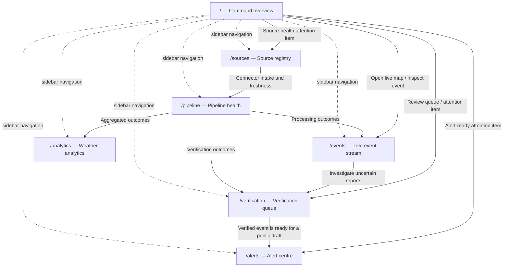
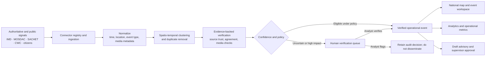
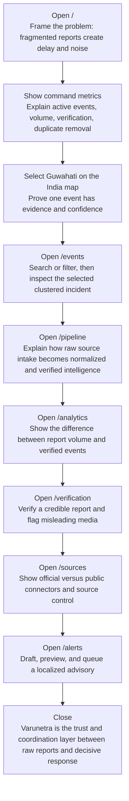

# Varunetra Website Route and Presentation Guide

Varunetra is a national weather-intelligence operations prototype. It turns fragmented weather signals into a single, evidence-backed operating picture so disaster-management teams can decide what needs attention, what needs review, and what is ready for public communication.

This guide is for a jury presenter and for a new teammate who needs to understand the complete website journey.

## What this prototype proves

The dashboard demonstrates the intended operational workflow: sources feed an intelligence pipeline; reports are normalized, clustered, confidence-scored, and either reviewed by an analyst or prepared for dissemination. The displayed events, metrics, connector statuses, and charts are deterministic demo data. The user interactions in the interface—filtering, selecting, reviewing, toggling sources, retrying jobs, drafting alerts, and generating previews—are functional local UI behavior. It does not claim live production integrations or the production streaming/ML infrastructure.

Primary users are national and state emergency operations centres, weather and disaster-management analysts, district administrators, and public-information teams.

## Route reference

| Route | Screen | What it does | Key actions | Main connections |
| --- | --- | --- | --- | --- |
| `/` | Command overview | Gives the national operating picture and the highest-priority items. | Select a map incident; open the live map or review queue. | `/events`, `/verification`, `/alerts`, `/sources` |
| `/events` | Live event stream | Explores clustered, geolocated weather incidents. | Search, filter by hazard, select an event or map marker. | Entered from `/`; supports investigation before `/verification`. |
| `/verification` | Verification queue | Lets an authorized analyst resolve uncertain or consequential reports. | Verify, flag, undo, switch pending/resolved views. | Entered from `/` or after event investigation; verified work informs `/alerts`. |
| `/analytics` | Weather analytics | Separates incoming report volume from verified operational intelligence. | Review trend, hazard mix, regional intensity, and quality measures. | Explains outcomes of `/pipeline` and `/verification`. |
| `/alerts` | Alert centre | Converts a verified incident into a reviewable citizen advisory. | Choose event, edit message, enable channels, preview, queue. | Follows `/verification`; is linked from overview attention items. |
| `/sources` | Source registry | Shows and controls the connectors that supply the national graph. | Switch source intake, change source category, test connectors. | Explains the starting point of `/pipeline`. |
| `/pipeline` | Pipeline health | Shows the processing stages, performance, and recoverable exceptions. | Retry failed jobs. | Explains how `/sources` becomes events, verification, and analytics. |

## Route connection map

The sidebar exposes every route, but the recommended story is not a random tour. Start with the command view, investigate a concrete event, explain how uncertain records are governed, show how the system is supplied and monitored, then end at public alert readiness and measurable impact.

## Route-by-route explanation

### `/` — Command overview

**Problem solved:** Operators need one place to judge national conditions before opening individual reports. The screen combines active-event scale, daily intake, verification rate, duplicate reduction, a national India map, a selected-event brief, attention items, report velocity, and source health.

**What to present:** Begin with the four headline metrics. They establish that the platform handles noisy volume rather than merely displaying a forecast. Select the Guwahati marker on the map and point to its severity, confidence, source evidence, and incident summary in the adjacent panel. This is the core product claim: multiple reports become one evidence-backed operational event.

**Interaction and state:** Choosing a marker changes the selected incident and its brief. The header buttons lead directly to the live event monitor and review queue. Attention cards lead to verification, alerts, or sources; the source card makes a useful bridge into the supply side of the platform.

**Feeds and next step:** This is the consumer of the whole workflow. Move to `/events` to show the selected map event in investigative detail, or to `/verification` when the story is about human oversight.

### `/events` — Live event stream

**Problem solved:** A national map is useful for prioritization, but analysts need a focused way to find and inspect an incident. This workspace combines search, event-type filtering, a map, and a detailed stream of clustered/deduplicated reports.

**What to present:** Filter to a weather type and search for a city such as Mumbai. Then select the Guwahati flood item. Explain that markers represent event clusters—not every raw social post or sensor record—and that the visible confidence and source detail are the reason an operator can act on the result.

**Interaction and state:** Search text and hazard filter reduce the visible stream. Selecting either a stream card or a map marker updates the active event. An empty state appears when no record matches, demonstrating that the view is a usable workspace rather than a static image.

**Feeds and next step:** The workspace represents outputs after normalization, clustering, and verification scoring. Take uncertain or high-impact cases to `/verification`; take the wider pattern to `/analytics`.

### `/verification` — Verification queue

**Problem solved:** High-impact decisions should not rely only on automated confidence. This route gives an analyst a controlled place to decide whether uncertain evidence is verified or misleading.

**What to present:** Open the Pending tab and identify the AI score, provenance signals, and confidence bar for a record. Verify the credible Dehradun report and flag the recycled Puri cyclone media. Explain that the system preserves the recommendation and evidence, but a human owns consequential decisions.

**Interaction and state:** Verify and Flag actions update the record’s decision state; Undo restores it. Pending and Resolved tabs present the queue before and after analyst action. If all items are resolved, the interface intentionally shows a queue-cleared state.

**Feeds and next step:** Inputs are the uncertain/high-impact cases surfaced by the event workflow and scoring pipeline. A verified incident can be taken to `/alerts` for a geo-targeted public advisory.

### `/analytics` — Weather analytics

**Problem solved:** Leaders need to understand whether more reports mean more real events. This view separates report velocity from verified output and summarizes risk by hazard and geography.

**What to present:** Use the national trend to distinguish incoming reports from AI-verified events. Then point to regional intensity, hazard mix, auto-verification, human agreement, false-positive rate, and removed noise. These measures explain why Varunetra is a trust-and-coordination layer rather than a weather app.

**Interaction and state:** This route is intentionally a readable decision summary; its values are seeded rather than live-query controls.

**Feeds and next step:** The charts aggregate pipeline and verification outcomes. Return to `/pipeline` to explain the operational stages that produce the metrics, or `/events` to investigate a high-intensity region.

### `/alerts` — Alert centre

**Problem solved:** A verified event must become clear public guidance without losing locality, severity, or operator control. This screen drafts a CAP-ready advisory and previews the citizen-facing result.

**What to present:** Select a verified incident, then show how the headline, public instruction, delivery channels, and preview are all controlled. Generate the preview before queueing the alert. State that the prototype prepares an advisory for supervisor approval; it does not claim to send a real national warning.

**Interaction and state:** Selecting an event updates its verification context. The presenter can edit headline and instruction, toggle mobile/web and SMS, generate a preview, and queue the completed draft. Queueing only succeeds when text and at least one channel are present, then displays the supervisor-approval confirmation.

**Feeds and next step:** This route follows a verified event from `/verification`. It is the public-facing endpoint of the operational workflow; return to `/sources` or `/pipeline` only when explaining how trustworthy evidence was created.

### `/sources` — Source registry

**Problem solved:** Operators need visibility and control over the official, community, and public-signal connectors contributing to the national graph. A degraded source should be visible without deleting its history.

**What to present:** Show the official and community tabs, source health, intake rate, enabled connector count, and the distinction between trusted official inputs and corroborated public signals. Toggle a public source and test all connectors to demonstrate operational control.

**Interaction and state:** Each source can be enabled or disabled for new intake. Tabs change source category. Testing connectors displays a temporary healthy result. These are local prototype controls over seeded source records.

**Feeds and next step:** Sources are the entry point to the system. Go to `/pipeline` immediately afterward to show the journey from raw intake to usable intelligence.

### `/pipeline` — Pipeline health

**Problem solved:** A national system must explain not just results but the health of the path that created them. This screen exposes stage throughput, health, latency, queued jobs, and recoverable exceptions.

**What to present:** Walk left to right through ingest, normalize, verify, and downstream stages. Point to throughput, total lag, and the exception table. Use Retry failed jobs to explain that recoverable work is retained for replay rather than silently discarded.

**Interaction and state:** Retrying briefly changes the action state. The stage cards and exceptions are seeded observability data; they model the controls a production operator would use.

**Feeds and next step:** It begins with `/sources` and feeds the event monitor, verification queue, and analytics. Use it as the technical bridge in a presentation, then return to `/analytics` for outcomes or `/verification` for human governance.

## Conceptual intelligence flow

## Detailed presentation flow

## Presenter notes

**Claims to make:** Varunetra models India-scale multi-source incident intelligence; it preserves provenance, removes duplicates, makes confidence explainable, routes uncertain cases to people, and prepares verified events for operational response.

**Claims to avoid:** Do not say that the dashboard has live IMD/MOSDAC/SACHET ingestion, that every visible number is real-time, or that a queued alert has been sent to citizens. Present these as a reliable simulated demo and an implementation-ready production direction.

**Useful handoffs:** `Sources → Pipeline` explains input-to-processing; `Pipeline → Events` explains usable intelligence; `Events → Verification` explains governance; `Verification → Alerts` explains how trusted evidence becomes public action; `Analytics` closes the loop with measurable quality and impact.
